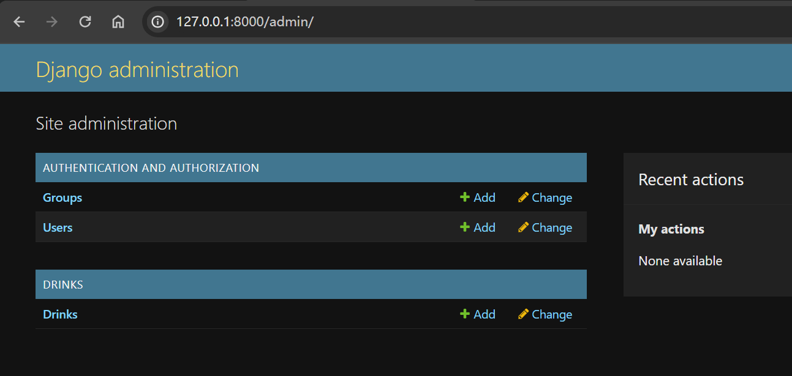

# Django_REST_Framework_Learning

- [Django\_REST\_Framework\_Learning](#django_rest_framework_learning)
  - [Create Django Project](#create-django-project)
  - [Create models](#create-models)
    - [Register Model in the Admin](#register-model-in-the-admin)
    - [Define a serializaer for a model](#define-a-serializaer-for-a-model)
  - [List](#list)
    - [Define an view](#define-an-view)
    - [Define a URL](#define-a-url)
    - [Test](#test)
  - [CRUD](#crud)
    - [Create](#create)
    - [Retrive a specific object](#retrive-a-specific-object)
    - [Update](#update)
    - [Delete](#delete)
  - [Test using `requests`](#test-using-requests)

---

A repo of project to learn Django REST-Framework

- Tutorial ref:

  - https://www.youtube.com/watch?v=i5JykvxUk_A&t=472s

---

## Create Django Project

- Create and activate venv
- install dependencies:

  - `pip install django`
  - `pip install djangorestframework`

- Start a Django project

```sh
django-admin startproject drinks .  # drinks is the name of this project
python manage.py runserver          # run server
python manage.py createsuperuser    # create an admin account.
```

---

## Create models

- Create a file with the path of `/drinks/models.py`:

```py
from django.db import models


class Drink(models.Model):
    name = models.CharField(max_length=200)
    description = models.CharField(max_length=500)

    def __str__(self):
        return self.name + " - " + self.description
```

- Add model in the `settings.py`

```py
# Application definition

INSTALLED_APPS = [
    'drinks',       # add model
    # ...
]
```

- Make DB Migration and migrate

```sh
py manage.py makemigrations drinks      # make migration for drinks
py manage.py migrate                    # applpy any un-apply migration
```

---

### Register Model in the Admin

- create a file for admin `/drinks/admin.py`
- Register the model to admin site

```py
from django.contrib import admin
from .models import Drink

# register the model in the admin site
admin.site.register(Drink)
```



- Create 3 drinks using admin site


---

### Define a serializaer for a model

- Add DRF into settings `INSTALLED_APPS`

```py
# Application definition

INSTALLED_APPS = [
    'rest_framework',       # DRF
    'drinks',
    # ...
]
```

- Create a file `/drinks/serializers.py`
  - to process a Djnago model to Json.

```py
from rest_framework import serializers
from .models import Drink


class DrinkSerializer(serializers.ModelSerializer):

    class Meta:
        model = Drink
        fields = ['id', 'name', 'description']

```

---

## List

### Define an view

- Create a file `/drinks/views.py`

```py
from django.http import JsonResponse
from .models import Drink
from .serializers import DrinkSerializer


def drink_list(request):

    # get all objects of Django model
    drinks = Drink.objects.all()

    # serialize Django model objects
    # many: whether to serialize a list of items.
    serializer = DrinkSerializer(drinks, many=True)

    # return a json response,
    return JsonResponse({"drinks": serializer.data}, safe=True)


```

---

### Define a URL

- Create a path in the `/drinks/urls.py`

```py
from django.contrib import admin
from django.urls import path
from drinks import views

urlpatterns = [
    path('admin/', admin.site.urls),
    path("drinks/", views.drink_list)       # create a url entry
]
```

---

### Test


---

## CRUD

- Using `api_view` decorator, which takes a list of HTTP methods that your view should respond to.
  - By default only `GET` methods will be accepted.
    - Other methods will respond with "`405` Method Not Allowed".
  - can specify which methods the view allows

```py
# defalt method: get
@api_view()
def hello_world(request):
    return Response({"message": "Hello, world!"})

# specify get and post
@api_view(['GET', 'POST'])
def hello_world(request):
    if request.method == 'POST':
        return Response({"message": "Got some data!", "data": request.data})
    return Response({"message": "Hello, world!"})
```

---

### Create

```py
from django.http import JsonResponse
from .models import Drink
from .serializers import DrinkSerializer
from rest_framework import status
from rest_framework.decorators import api_view
from rest_framework.response import Response

@api_view(['GET', "POST"])
def drink_list(request):

    # if the request's methos is GET
    if request.method == 'GET':
        # get all objects of Django model
        drinks = Drink.objects.all()

        # serialize Django model objects
        # many: whether to serialize a list of items.
        serializer = DrinkSerializer(drinks, many=True)
        # return a json response,
        return JsonResponse({"drinks": serializer.data})

    # if the request's methos is POST
    if request.method == 'POST':
        # deserialize the post data
        serializer = DrinkSerializer(data=request.data)
        print(serializer)

        # Check whether the post object valid
        # .is_valid():  Deserializes and validates incoming data.
        if serializer.is_valid():
            # .save():  Persists the validated data into an object instance.
            serializer.save()
            # return an api response with the created data and a status.
            return Response(serializer.data, status=status.HTTP_201_CREATED)
```

- Test using postman


---

### Retrive a specific object

- Define URL

```py
urlpatterns = [
    # ...
    path("drinks/<int:id>", view=views.drink_detail, name="drink_add")
]
```

- Edit `views.py`

```py

@api_view(['GET', "PUT", "DELETE"])
def drink_detail(request, id):      # accept 2nd parameter

    # try to get Django object based on the id
    # otherwise , return 404
    try:
        drink = Drink.objects.get(pk=id)
    except Drink.DoesNotExist:
        return Response(status=status.HTTP_404_NOT_FOUND)

    # retrive
    if request.method == "GET":
        # parse Django object to a serialier
        serializer = DrinkSerializer(drink)
        # return a api response with data
        return Response(serializer.data)
```

- Test


---

### Update

- Edit view

```py
@api_view(['GET', "PUT", "DELETE"])
def drink_detail(request, id):      # accept 2nd parameter

    # try to get Django object based on the id
    # otherwise , return 404
    try:
        drink = Drink.objects.get(pk=id)
    except Drink.DoesNotExist:
        return Response(status=status.HTTP_404_NOT_FOUND)

    # retrive
    if request.method == "GET":
        # parse Django object to a serialier
        serializer = DrinkSerializer(drink)
        # return a api response with data
        return Response(serializer.data)

    # update
    if request.method == "PUT":
        serializer = DrinkSerializer(drink, data=request.data)

        # if valid
        if serializer.is_valid():
            # save update
            serializer.save()
            # return with newest data
            return Response(serializer.data)
        # Otherwise, return 400 status with errors
        return Response(serializer.errors, status=status.HTTP_400_BAD_REQUEST)
```


---

### Delete

- edit

```py

@api_view(['GET', "PUT", "DELETE"])
def drink_detail(request, id):      # accept 2nd parameter

    # try to get Django object based on the id
    # otherwise , return 404
    try:
        drink = Drink.objects.get(pk=id)
    except Drink.DoesNotExist:
        return Response(status=status.HTTP_404_NOT_FOUND)

    # remove
    if request.method == "DELETE":
        # delete item using Django
        drink.delete()
        return Response(status=status.HTTP_204_NO_CONTENT)
```

- Test:
  - request delete


---

## Test using `requests`

- install:

  - `pip install requests`

- Create a file `/consume.py`

```py
import requests

HOST = "http://127.0.0.1:8000"
LIST_DRINK = f"{HOST}/drinks"

response = requests.get(LIST_DRINK)
print(response.json())
```

- Run py file

```sh
py consume.py
```


---

[TOP](#django_rest_framework_learning)
